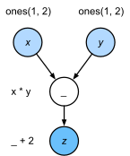
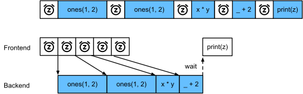
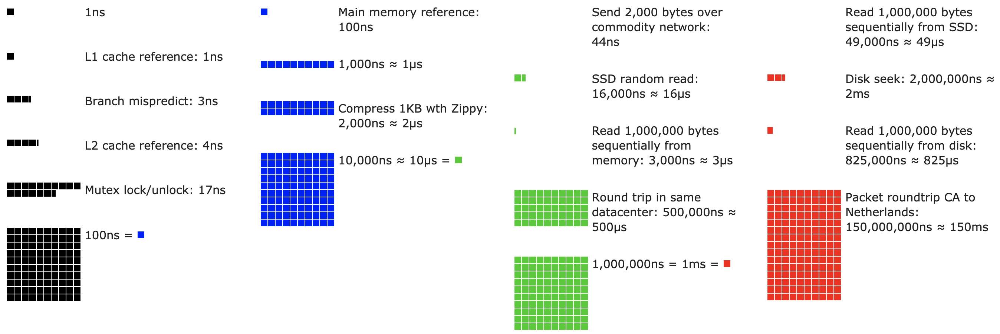
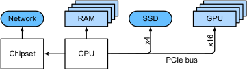
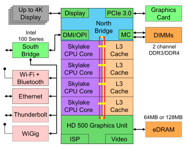
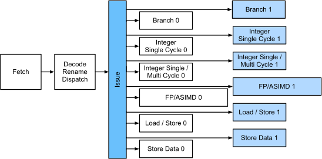
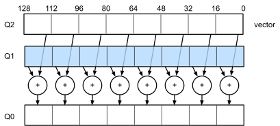
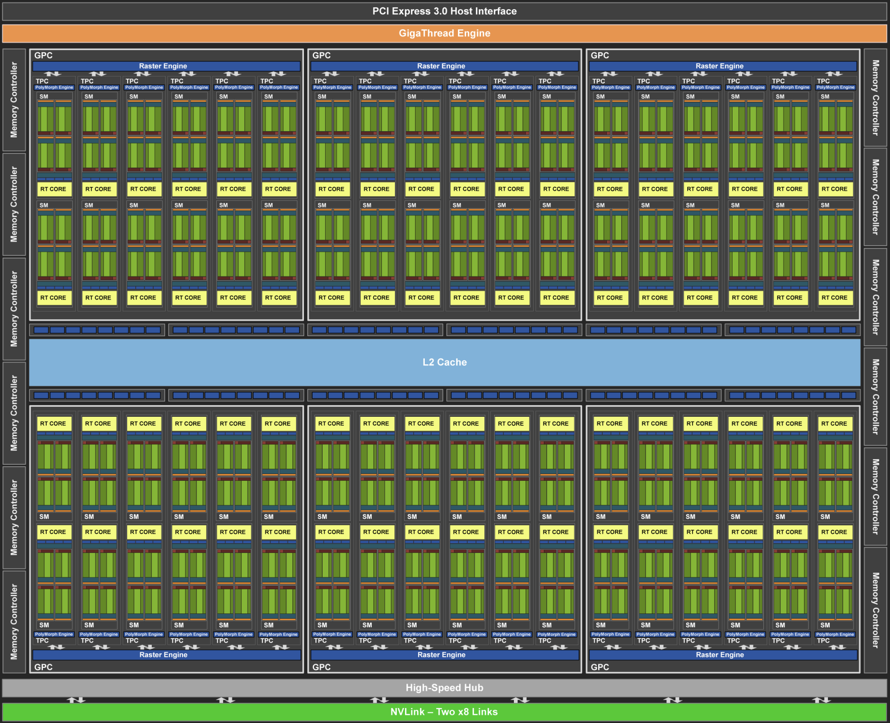
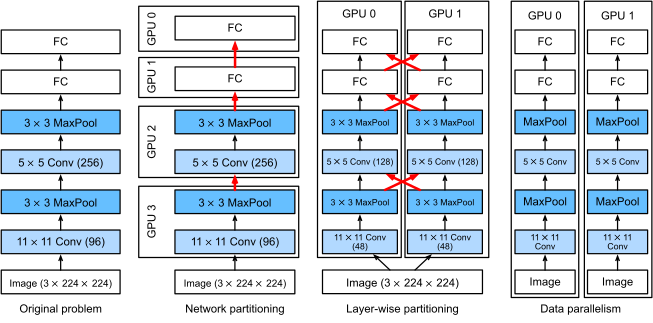
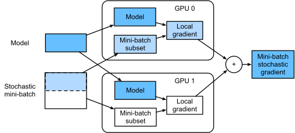

# Notes

## Imperative vs. Symbolic programming
In imperative, codes are executed sequentially, and memory is allocated for any variables defined in the code. In symbolic, the code is compiled and hence could be optimized. For example, if a variable is only used in another function, and never afterwards, the compiler can know this and optimize such that the output of a function is directly ran as input to another without needing to allocate memory for the variable in between.

Imperative: Easier to write. Easier to debug, since all intermediate variables could be printed or debugger can be used.

Symbolic: More efficient in a compiled code and hence easier to port, since does not depend on python anymore.

On a server with 8 high-end GPUs, a single threaded python to manage all of them will be the bottleneck. Therefore for production, we need such optimized models.

### Hybrid
Tensorflow 2.0 added imperative, pytorch is imperative. But by using a JIT torchscript one can write imperative code and compile the network (model) to compiled code ```torch.jit.script(net)```.

## Serialization
By compiling a model using torchscript for example, we can also serialize (save) the model and its parameters independent of the front-end framework used for running the model. Hence it can be used with any front-end framework or device.

## Asynchronous computation
Often, computations are done on multiple CPU cores, each running many threads with multiple GPUs. In short, we can process many different things in parallel at the same time. However, Python is not a good tool to write parallel asynchronous code, at least not without some help. Understanding the concepts allows to reduce memory overhead and increase processor utilization.

GPU operations in Pytorch is asynchronous, meaning that operations are enqued and left to be executed on GPU and when finished return to the frontend python interpreter.

Broadly speaking, PyTorch has a frontend for direct interaction with the users, e.g., via Python, as well as a backend used by the system to perform the computation. users can write PyTorch programs in various frontend languages, such as Python and C++. Regardless of the frontend programming language used, the execution of PyTorch programs occurs primarily in the backend of C++ implementations. Operations issued by the frontend language are passed on to the backend for execution. The backend manages its own threads that continuously collect and execute queued tasks. Note that for this to work the backend must be able to keep track of the dependencies between various steps in the computational graph. Hence, it is not possible to parallelize operations that depend on each other.

Consider the computational graph depicted below which can be written in PyTorch using Python.
```Python
x = torch.ones((1, 2), device=device)
y = torch.ones((1, 2), device=device)
z = x * y + 2
z
```


Whenever the Python frontend thread executes one of the first three statements, it simply returns the task to the backend queue. When the last statement’s results need to be printed, the Python frontend thread will wait for the C++ backend thread to finish computing the result of the variable z. One benefit of this design is that the Python frontend thread does not need to perform actual computations. Thus, there is little impact on the program’s overall performance, regardless of Python’s performance. Fig. below illustrates how frontend and backend interact.



### Blockers and Barriers
Some code blocks the backend, halting the steps used asynchronously in the backend to return execution to frontend. In the d2l.ai course, they didn't mention it for pytorch but sth like b.wait_to_read() or torch.waitall(). Besides these *implicit* blockers,

`print` is another blocker, since it requires the variable to be available and hence blocking operations.

Also **conversion** to NumPy such as `z.asnumpy()`. It needs access to values just like print.

### Communication between frontend and backend
Writing asynchronous code is essential, not only for multi-core cpus but more for servers with multiple cores which happens using sockets.

consider the following example:
1. $t_1$: Frontend orders backend to put some computation task in the queue.
2. $t_2$: Backend receives computation task and executes it.
3. $t_3$: Backend returns computation results to the frontend.

Without asynchronous, the cost of doing 10000 such computations is approciamtely $10000 (t_1 + t_2 + t_3)$.

With asynchronous frontend sending computations assuming that $t_2 > t_1$ will be $t_1 + 10000t_2 + t_3$ since the frontend does not need to wait for backend to return results for each operation.

## Automatic Parallelism on multiple GPUs and CPU

Consider the code below:

```Python
devices = d2l.try_all_gpus()
def run(x):
    return [x.mm(x) for _ in range(50)]

x_gpu1 = torch.rand(size=(4000, 4000), device=devices[0])
x_gpu2 = torch.rand(size=(4000, 4000), device=devices[1])

run(x_gpu1)
run(x_gpu2)  # Warm-up all devices
torch.cuda.synchronize(devices[0])
torch.cuda.synchronize(devices[1])

with d2l.Benchmark('GPU1 time'):
    run(x_gpu1)
    torch.cuda.synchronize(devices[0])

with d2l.Benchmark('GPU2 time'):
    run(x_gpu2)
    torch.cuda.synchronize(devices[1])
```
```
GPU1 time: 0.4967 sec
GPU2 time: 0.5151 sec
```

`torch.cuda.synchronize()` if given a device, waits for result on all cores and if None, waits for all.

Now the case with 'Auto Parallelism' of Pytorch.

```Python
with d2l.Benchmark('GPU1 & GPU2'):
    run(x_gpu1)
    run(x_gpu2)
    torch.cuda.synchronize()
```
```
GPU1 & GPU2: 0.5000 sec
```

PyTorch has ran the tasks on both GPUs in parallel, leading to half the time needed for both.

### Parallel computaion - non-blocking
When training on multiple GPUs, we need to aggregate gradients on a single device, e.g. the CPU. Hence there is a communication overhead. However, if we use non-blocking communication, this means that when some parameters are already computed while it is still running on GPU, we could still transfer the ones already finished. For example if we are collecting a list like the example before. Some communication functions such as `.to()` and `_copy()` have a non-blocking parameter for this purpose which makes the communication faster and starts already using the bandwidth for the ones already computed.

```python
def copy_to_cpu(x, non_blocking=False):
    return [y.to('cpu', non_blocking=non_blocking) for y in x]

with d2l.Benchmark('Run on GPU1'):
    y = run(x_gpu1)
    torch.cuda.synchronize()

with d2l.Benchmark('Copy to CPU'):
    y_cpu = copy_to_cpu(y)
    torch.cuda.synchronize()
```
```
Run on GPU1: 0.5019 sec
Copy to CPU: 2.7168 sec
```

```Python
with d2l.Benchmark('Run on GPU1 and copy to CPU'):
    y = run(x_gpu1)
    y_cpu = copy_to_cpu(y, True)
    torch.cuda.synchronize()
```
```
Run on GPU1 and copy to CPU: 2.4682 sec
```

The total time for both is less when using non-blocking transfer. **Note** that this is different than parallelism, since it is making efficient use of another resource **the BUS between GPU and CPU**. As noted above, there is a dependency between computation and communication: y[i] must be computed before it can be copied to the CPU. Fortunately, the system can copy y[i-1] while computing y[i] to reduce the total running time.

This picture shows the communications for training on two GPUs with transferring (communication via Bus) the training batch, gradients, and updated weights between CPU and the two GPUs for a 2layer MLP with Parallelism between the twoo GPUs and non-blocking communicaiton.


## Hardware
Some latency numbers you should know about.


### Computers
Computation components in a computer are:

* CPU (processor): typically consisting of 8 or more cores. Runs the program + os etc.
* Memory (RAM): to store and retrieve intermediate values and results such as weights and training data
* Ethernet network connection: speed range from 1GBs to 100GBs
* Highspeed expansion bus (PCIe): to connect high-bandwidth for data transmission e.g. CPU to multiple GPUs
* Storage (Magnetic (old, archive data), SSD)



Memory is usually directly connected to the CPU with speeds upto 100GBs.
Network, GPU, SSD are connected via PCIe. For example a highend CPU can have 64 PCIe each with 16Gbs data transmission.

### CPU memory (RAM)
Data that can be readily accessible. Now typically DDR4 with 20-25GBs bandwidth per module. Each module has 64-bit-wide bus, pairs of modules is used to link with CPU to allow for multiple channels from 2 to 4 which results in 40 to 100GBs data transmission.

When we want to read data from memory, the address needs to be sent to tell module where to load the data from. With this we can choose to read a single 64bit record, or a series of records (called **burst read**). The first read takes 100ns. subsequent ones take 0.2ns. So burst reads is much much more efficient than single reads (subsequent reads 500times faster). This suggests we avoid random reads as possible and do burst reads.

It is more detailed. Memories have multiple banks. Each bank can read memory largely independently, given that data is distributed on the memory. So the above numbers are 4 times faster for a memory with 4 banks.

GPUs are data hungrier than CPU since they have more processors, hence larger bandwidth is required so that processors don't starve. In order to allow for higher data transfer rates, memory bus of GPU is wider (NVIDIA RTX 2080 Ti has 352-bit-wide Bus). Highend server chips such as Volta V100 connect directly to the GPU on a dedicated silicon wafer. Because of this faster and higher bandwidth, GPUs typically have lower memory.

### Storage

HDD: very slow, magnetic rotor spins, can not make it faster because of physics and it will shatter. used for archive data.

SSD: can operate at 100,000-500,000 IOP (input-output operations), 3 magnitudes faster than HDD. However, it has the following minor issues:
* wear out quickly. So not recommended to use for storing large files. wears out after usually a few tousand read-writes.
* Stores information in large blocks 256KB or larger. So very bad for bit-wise operations.

### CPUs
main computation core for executing code. 


A CPU core reads assembly, translates into lower microarchitecture execution blocks. Each core implements different but almost same micro execution blocks, and they can be ran at the same time. So an efficient code can run multiple operations per clock cycle (in the image below 8 at same time) if they are different and independent.



Almost all CPUs have vector computations units which are specialized for vector arithmetic. In ARM they are called NEON, on x86 AVX2.

such register although vary but typically can carry out 512 bits long such operations, allowing for combination of 64 pairs of numbers.

### Cache
Fast accessed memory on the CPU since to get clock level speed is impossible with RAMs and CPU will starve of data for computations possible to do. 

Registers are not exactly cache. They help stage instructions. Are memory locations on CPU that can be accessed at clock speed. CPUs have tens of registers. E.g. in C they can be allocated by `register` keyword.

L1 cache is the next fastest. they are tiny 32-64KB. If data can't be found on L1, it progresses to search down the other caches.

L2 caches are the next stop. 256-512KB larger but slower than L1. extra latency because we first need to search on L1.

L3 can be quite large. 4-8 MB, and 256 MB for servers.

Adding more caches is a double edge sword scenario for vendors. It occupies wafed space which could alternatively be used for computation. But if too small, CPU starves of data. 

### GPU, Accelerators
Can be designed specifically for train or inference. For example for inference, they do not need to store intermediate values for backpropagation. They do not require high precision because no gradient computation and no underflow or overflow, FP16 or INT8 usually suffice. For example NVIDIA Turing T4 GPU designed for inference, wheras V100 for training.

Modern variants include Tensor units. Similar to vector units on CPUs but for matrices.


NVIDIAs Turing Processor Block consists of 16 int and and floating points units. in addition, 2 cores that do other relevant computations for deep learning. Each streaming multiprocessor consists of 4 such blocks. 12 of them are grouped into graphics processing clusters. This modular build up is for reliability, and also modular design and manufacturing. Collecting a bunch for example gives the Turing architecture.


### Networks and Buses
As need for computation increases, several cores need to be connected for data transfer and synchronization. There are different choices:

* Ethernet: Not at all good because of speed and latency. Noone uses them for deep learning. But good is no wire, no space resitrictions, flexibility, ...
* PCIe: very fast with low latency e.g. for connecting GPUs to CPU. But very low number available on CPU and some has to be used for peripherals. AMD's Epyc3 has 128 lanes, Intel Xeon 48 per core. desktop grade CPUs: Ryzen9 20 lanes, Corei9 16. GPUs typically have 16 lanes, so this limits the number of GPUs can be connected to CPU.
* NVLink is an alternative to PCIe. upto 300Gbs data transfer rate per link e.g. for Volta V100 GPU servers have 6 links. RTX2080Ti has one link with reduced 100Gbs rate.

## Training on multiple GPUs
For example for training on 2 GPUs on a desktop with 2 GPU, or on AWS with 4 GPUs on g4dn.12xlarge instance. 8 on p3.16xlarge or 16 on p2.16xlarge.

One approach, e.g. for large models is to distribute subsequent layers on multiple GPUs each running a up until a point with transfering outputs between them. But can it be linearly scaled w.r.t number of GPUs? noone knows. but it is very hard. how should it be distributed? some might take more, some less, so no clear way. not recommended at all. only with good reasons.

Next is to divide between GPUs across channels. But good synchronization is required between them to account for channels on the other GPUs. When GPUs were small, AlexNet was designed on two GPUs in such a manner.

But the transfer of data for synchronization is huge here, hence not recommended.

Last and simplest distribution, partition data across GPUs. This way all GPUs perform the same type of work albeit on different observations. Gradients are aggregated after minibatch of each one. Simplest and can be applied to any scenario. Allows for faster training, However more GPUs does not lead to larger models being used. 

Comparison of the three methods described.


### Data-parallellism on multiple GPUs

For each iteration, the minibatch data is partitioned to the multiple GPUs, model shared and synchronized, gradients aggregated, the aggregated gradients are redistributed to each GPU for model update.
