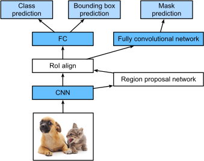

# Image Augmentation
Larger dataset is better. Adding random noise to data better for generalization and not focus on specific attributes of image.

`torchvision.transforms.`:
* `RandomHorizontalFlip(p)`
* `RandomVerticalFlip(p)`
* `RandomResizedCrop(size, scale, ratio)`
* `ColorJitter(brightness, contrast, saturation, hue)`

For combining multiple augmentations use `torchvision.transforms.Compose([transoforms])`.

Use `ToTensor` as a transformation in the end to change images to tensor values expected by DL frameworks, ie. FP32 between 0 and 1 in the shape (batch_size, num_channels, width, height).

Only do changing augmentations for training and not testing. Both train and test transforms should have ToTensor. 

# Fine Tuning
For example for identifying chairs, we usually go and collect some images from different images. But because the cost of collecting and annotating data is very expensive, usually we take a large dataset such as ImageNet with millions of images, and then do transfer learning from the dataset to the target dataset. This way, the model can learn general understanding of image such as edges, textures, shapes, and object composition from the large dataset. These features might be effective for recognizing chairs too. 

Steps for fine-tuning:
1. Train a model on the large dataset.
2. Keep all the lower layers (base and stem) and replace the output layer (head) and initialize its weights. Also modify based on need for example number of output classes.
3. Train the whole model. Lower layers get fine-tuned. Output layer is trained from scratch on the target dataset.

A pretrained model can be loaded with `torchvision.models.resnet18(pretrained=True)`. For example this is how you do surgery on a resnet18 to adapt it for binary classification,

```Python
finetune_net = torchvision.models.resnet18(pretrained=True)
finetune_net.fc = nn.Linear(finetune_net.fc.in_features, 2)
nn.init.xavier_uniform_(finetune_net.fc.weight)
```

One can also change choose higher learning rates for the head and lower for lower layers.
```
params_1x = [param for name, param in net.named_parameters()
             if name not in ["fc.weight", "fc.bias"]]
trainer = torch.optim.SGD([
    {'params': params_1x},
    {'params': net.fc.parameters(), 'lr': learning_rate * 10}],
    lr=learning_rate, weight_decay=0.001)
```

# Object Detection
In contrast to Classification task where there is one main object in the image, in detection task, we are interested in different objects and their positions.

## Bounding Box (bbox)
One way to show is upper-left, lower-right cooridinates, or center + width and height (or upper-left + width and height).

## Anchor Box
Referes to sampling many bbox and then refine and select best of them. For example, for each pixel, one can create different bbox around it by choosing width and heights based on scale ($s \in (0, 1]$) and ratio $r>0$. This way, width and height are $hs\sqrt{r}$ and $hs/\sqrt{r}$ (h is height of image and w width of image (and not anchor boxes)). Consider having n scales and m ratios. total number of anchor boxes will be whnm which is too many. Hence we consider a subset of these for example only those that have s1 or r1 in it. this leads to wh(n+m-1) number of anchor-boxes if placed at each pixel.

## IOU - Jaccard index
A quantity measure for two sets. intersection over union of anchor-box and ground-truth bounding-box.

### Anchor Boxes as training data
In Object detection, each predefined anchor box as implemented in [Object Detection notebook](./1_object_detection.ipynb). Here, based on a list of scales and ratios, we generated anchor boxes per pixel. In Object detection, each anchor box is a training data for the model, where the annotations are 1. the class of the class of the closest gt bbox in dataset and 2. offset of the gt bbox relative to the anchor box.

At prediction time, for each of the generated anchor boxes, the network predicts the class and the relative offset, and based on these and a selection of anchor boxes, bbox outputs for different objects in image is predicted.

### Assign gt bbox to anchor boxes
Now that we have a set of anchor boxes, construct a matrix with rows being the different anchor boxes and colomn gt bbox. Compute the max IOU, and assign the two together. and do this until all gt bboxs are removed. For the remaining anchor boxes over a certain threshold, determine their gt bbox and finished.

### Labeling anchor box with classes and offsets
Now that we have assigned gt boxes to anchors, we can set their labels for training. class labels will be the same as gt box. For the offset, we compare the center points and width and height of the two. Consider A the anchor and B the assigned gt box. We may label the offset for A as,

$
(\frac{\frac{x_b-x_a}{w_a}-\mu_x}{\sigma_x},
\frac{\frac{y_b-y_a}{h_a}-\mu_y}{\sigma_y},
\frac{\log\frac{w_b}{w_a}-\mu_w}{\sigma_w},
\frac{\log\frac{h_b}{h_a}-\mu_h}{\sigma_h})
$
with constants typically chosen as $\mu_a=\mu_b=\mu_w=\mu_h=0, \sigma_x=\sigma_y=0.1, \sigma_w=\sigma_h=0.2$.

Those anchor boxes not assigned a gt box will be labeled as 'background'.

### Prediction of bbox from anchor boxes
During prediction, we generate multiple anchor boxes and predict object and offsets for each. This will lead to multiple boxes surrounding object with high overlap. To refine, we use Non-maximum-suppression. This is how it works:

Given a list of adjusted bbox predictions, the model also assigns a probability to the label (confidence score, what you get raw from class score). Sort the list, choose the box with the highest score, remove all except for the maximum that have IOU with the max excedding a threshold. This is called non-maximum suppression. put aside the first max bbox, pick the one with the highest confidence score now and non-maximum suppress the rest. Repeat until all discarded. All these boxes are the detected objects in the image.

### Note about Detection datasets
Images can have varying number of objects and therefore different gt bbox numbers. Therefore, in order to use minibatch for training, a large number is decided to pad the number of bounding boxes for each sample with assigning the label class as -1 as the invalid bboxes.

Moreover, the positions are between 0 and 1 and scaled wrt image dimensions.

# Multiscale Object Detection
Instead of generating different anchors for each pixel that can generate millions of anchors and also to adapt for detecting objects of different sizes, a multiscale approach is used. Here, some c feature maps (DNN being layer wise is very helpful for this) are chosen to represent objects at different scales (think of receptive field of them representing different objects). For each map, hw sets of uniformly distributed setsof anchors, each having the same center pixel, is generated. Each set consists of multiple anchor boxes with different ratios and sclaes possibly. For each set at the corresponding layers, the feature maps are used to predict detection outputs for each anchor box. This way, one can get bbox predictions at different scales only by one pass in NN using their differnt layers. For training the detector, labels and offsets for anchors at each feature map level can be extracted by looking at the object corresponding to its receptive field.

# Single Shot Multibox Detection model (SSD)
This model uses a base network (e,g, ResNet or VGG with classification layer removed) followed by several multisclae feature map blocks. Each feature map block predicts boxes and labels for a different size. Deeper blocks have fewer anchors and larger receptive field, responsible for the few large objects in the image.


Let the number of object classes be q. Then anchor boxes have q+1 classes, where 0 is background. At some scale, let the feature map have h and w height and width. For each spatial position if we have a anchors, this makes a total of hwa anchors for that sclae that need to be assigned labels. Using FC for this purpose is infeasible due to parameterization costs. Therefore convolutional layers are used to predict the classes. The **class prediction layer** in SSD is used for this purpose. Here a convolution layer is used to map a feature map of size hw to a map of the same size but with a(q+1) channels. Each channel represents one of the classes for the a anchors at each spatial position of the feature map. Therefore, the output channel with index i(q+1)+j represents for all of the positions the class with index j and for the anchor box i at those positions.

The **bounding box prediction layer** is similar to the above, just predicting four numbers instead of the q+1 classes representing the four offsets.

The implementation is code heavy and you could look it up in the [SSD](./Object_detection.ipynb) notebook.

## Region-based CNN (R-CNN)
RCNN too slow and uses a pretrained CNN and generates regions and runs feature extraction for each region resized to the CNN input. This is too costly, not worth spending time, we skip it here.

## Fast R-CNN


Here the CNN is trained in the whole process. Selective Search creates region proposals with various sizes and shapes. consider an input of 1xcxhxw. ROI pooling layer, is a pooling layer and serves to get regions of the same size from various sizes and ratios of the selective regions proposed. assume h2 and w2 are considered as the pooling dimensions. ROI pooling divides the regions of various size and ratios to h2xw2 subwindows and performs pooling in each subwindow, hence outputing pooled region proposals of size h2xw2. For a total of n regions, all these regions can be concatenated in the shape of nxcxh2xw2. The process is shown below for an input image of size 4x4 and h2=w2=2.


The rest is just FC to produce class label and offset values for each pooled region of interest.

## Faster R-CNN
For Fast R-CNN to be effective, the selective search module needs to generate a lot of regions. In Faster R-CNN, the selective search is replaced by a *region proposal network*. The rest of the model is the same as Fast R-CNN.


The steps for the region proposal network is as follows,

1. Use conv3x3 with padding 1, on the output of CNN network to construct c feature maps with the same spatial dimensions.
2. Create various size and ratio anchor boxes centered at each unit of spatial. each anchor will have a feature vector of length c.
3. For each anchor, predict **binary** labels (Object or background) and also offsets for anchors. 
4. Only choose the ones predicting objects. Use NMS to remove overlapping ones.

The rest is as before. This model is trained end-to-end, containing both the multi-class classification and offsets loss of the main network, and also contains the binary classification loss and offsets for the region proposal network.

## Mask R-CNN
Here, if additional pixel-level objectness of the data is available, this extra information is used to get better detection results.



Most is similar to faster r-cnn, the ROI pooling layer is replaced with *ROI align*. This region of interest alignment layer uses bilinear interpolation to preserve the spatial information on the feature maps, which is more suitable for pixel-level prediction. The output of this layer contains feature maps of the same shape for all the regions of interest. They are used to predict not only the class and bounding box for each region of interest, but also the pixel-level position of the object through an additional fully convolutional network. 

# Semantic Segmentation
Here the object detections are at pixel-level and therefore more precise. Also note that unlike in classification where we easily resize images to fit to network input, here it is not suitable as it will cause issues with the labels. Therefore here croping is used to fit to network input.

## Transposed convolutions
This upsamples the input spatial dimensions which is required for semantic segmentation to have the same shape as input. The figure below shows it for input 2x2 and a kernel of 2x2 with stride 1.


Basically the kernle is multiplied with the number at each spatial position of the input, and placed in the same position. Finally, all the overlapping values are summed up. For input h,w and kernel h_k, w_k, the output size will be $(h+h_w-1, w+w_k-1)$. Unlike conv layer that pools the input, transposed conv **broadcasts** the input through the kernel.

```Python
def trans_conv(X, K):
    h, w = K.shape
    Y = torch.zeros((X.shape[0] + h - 1, X.shape[1] + w - 1))
    for i in range(X.shape[0]):
        for j in range(X.shape[1]):
            Y[i: i + h, j: j + w] += X[i, j] * K
    return Y
```
Unlike conv, here **padding** removes the edges of the output of transposed conv output.

**Stride** is also applied on the intermediate values (hence output) and not input. For example by changing stride of the above example from 1 to 2, we get,


*Note*: Good to remember, if f is a conv layer with some parameters for kernel size, stride, and padding, using a transposed conv with exactly the same parameters on Y=f(X) yields the same spatial dimensions as X.

## Fully Convolution Network (FCN)
refers to a network where gives the same spatial dimensions as input, but uses convolutions and transposed convolutions in the end to get back to the same dimensions.


The 1x1 conv is used to map the channels of the output of the CNN to match the number of classes before being upsampled.

### Initialization of transposed convolutional layers
As their job is upsampling, and there is the bilinear-interpolation, similar can be used here. How does bilinear interpolation work? consider x,y positions in the upsampled image, map it to x',y' in the input image, find the four closest pixels and by using weighted averaging, compute the value for x',y' and hence the value of x,y in the upsampled image.

similar idea is used for initializing the weights in the transposed conv layer.

```Python
def bilinear_kernel(in_channels, out_channels, kernel_size):
    factor = (kernel_size + 1) // 2
    if kernel_size % 2 == 1:
        center = factor - 1
    else:
        center = factor - 0.5
    og = (torch.arange(kernel_size).reshape(-1, 1),
          torch.arange(kernel_size).reshape(1, -1))
    filt = (1 - torch.abs(og[0] - center) / factor) * \
           (1 - torch.abs(og[1] - center) / factor)
    weight = torch.zeros((in_channels, out_channels,
                          kernel_size, kernel_size))
    weight[range(in_channels), range(out_channels), :, :] = filt
    return weight

W = bilinear_kernel(num_classes, num_classes, 64)
net.transpose_conv.weight.data.copy_(W);
```
som stuff are filled with `arange` functions and scaled according to the factor. These are filled in for all the channles.

### Prediction in semantic segmentation - dealing with sizes
For training, we already saw that we crop the images to fit the input. For prediction, we crop the whole image in few sets such that their union covers the whole image. For pixels cover by more than 1, we average the output of the transposed conv and use this average as input to the last softmax layer for classification.

# Neural Style Transfer

Pair of input image, one is the content and the other is the target style. Goal is to apply the style to the content image.


First a pretranied CNN is used to extract features of the images. Here a 3layer network is used. CNN is frozen in the process, while training only changes the parameters of the synthesized image. Dashed lines show the backpropagation pathes. 2nd layer is used for content comparison and 1st and 3rd layers are used for matching the style with the appropriate loss.

## Losses
Content loss is the squared difference of the content layer to be compared.

Style loss is also squared difference, but on the Gram matrix of the style layers each. Consider the output of a style layer be cxhxw. We can construct matrix X of shape cxhw where each row is the collection of features in each channel. The Gram matrix XX^T is the correlation of these features which can describe the style and not the details such as content comparison. Note that the values in Gram matrix depends on c,h,w size and since each layer has different ones, we normalize it by dividing it by chw.

Total Variation Loss: in order to reduce the noise in the synthesized image, *total variation denoising* could be used that makes the value of neighboring pixels closer to each other:

$
\sum_{i,j}|x_{i,j} - x_{i+1,j}| + |x_{i,j} - x_{i, j+1}|
$
