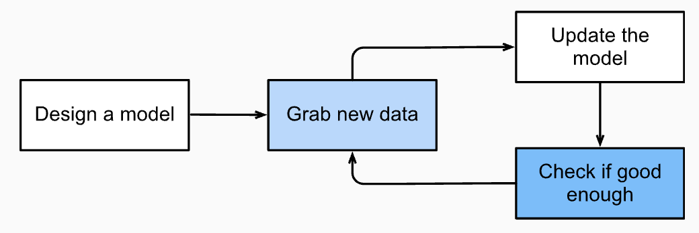
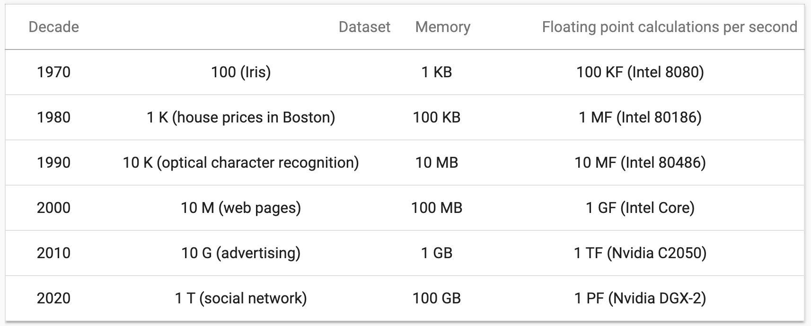

## Basics

Sometimes(most of the times), you just have to collect more and better data to your fit. E(xperience) is essential in TEP.

Data is important. "Garbage in, Garbage out". Example of garbage is recognizing skin cancer, without having black skin in the data. But how to systematically ensure that?

Model: does transformation to data, ingesting data from one side and spitting out, possibly in another form, data.

It is hard to overstate the generality of the reinforcement learning framework. For example, we can cast supervised learning problems as reinforcement learning problems. Say we had a classification problem. We could create a reinforcement learning agent with one action corresponding to each class. We could then create an environment which gave a reward that was exactly equal to the loss function from the original supervised learning problem.
As said, it is more general framework. it can solve problems that e.g. supervised cannot.

## Increase in computation, memory, and sensors

Note that random-access memory has not kept pace with the growth in data. At the same time, increases in computational power have outpaced the growth in datasets. 

# A list of amazing accomplishements in recent years

The recent progress in statistical models, applications, and algorithms has sometimes been likened to the Cambrian explosion: a moment of rapid progress in the evolution of species. Indeed, the state of the art is not just a mere consequence of available resources, applied to decades old algorithms. Note that the list below barely scratches the surface of the ideas that have helped researchers achieve tremendous progress over the past decade.

Novel methods for capacity control, such as dropout (Srivastava et al., 2014), have helped to mitigate overfitting. Here, noise is injected (Bishop, 1995) throughout the neural network during training.

Attention mechanisms solved a second problem that had plagued statistics for over a century: how to increase the memory and complexity of a system without increasing the number of learnable parameters. Researchers found an elegant solution by using what can only be viewed as a learnable pointer structure (Bahdanau et al., 2014). Rather than having to remember an entire text sequence, e.g., for machine translation in a fixed-dimensional representation, all that needed to be stored was a pointer to the intermediate state of the translation process. This allowed for significantly increased accuracy for long sequences, since the model no longer needed to remember the entire sequence before commencing the generation of a new sequence.

Built solely on attention mechanisms, the Transformer architecture (Vaswani et al., 2017) has demonstrated superior scaling behavior: it performs better with an increase in dataset size, model size, and amount of training compute (Kaplan et al., 2020). This architecture has demonstrated compelling success in a wide range of areas, such as natural language processing (Brown et al., 2020, Devlin et al., 2018), computer vision (Dosovitskiy et al., 2021, Liu et al., 2021), speech recognition (Gulati et al., 2020), reinforcement learning (Chen et al., 2021), and graph neural networks (Dwivedi and Bresson, 2020). For example, a single Transformer pretrained on modalities as diverse as text, images, joint torques, and button presses can play Atari, caption images, chat, and control a robot (Reed et al., 2022).

Modeling probabilities of text sequences, language models can predict text given other text. Scaling up the data, model, and compute has unlocked a growing number of capabilities of language models to perform desired tasks via human-like text generation based on input text (Brown et al., 2020, Chowdhery et al., 2022, Hoffmann et al., 2022, Rae et al., 2021). For instance, aligning language models with human intent (Ouyang et al., 2022), OpenAI’s ChatGPT allows users to interact with it in a conversational way to solve problems, such as code debugging and note drafting.

Multi-stage designs, e.g., via the memory networks (Sukhbaatar et al., 2015) and the neural programmer-interpreter (Reed and De Freitas, 2015) allowed statistical modelers to describe iterative approaches to reasoning. These tools allow for an internal state of the deep neural network to be modified repeatedly, thus carrying out subsequent steps in a chain of reasoning, similar to how a processor can modify memory for a computation.

A key development in deep generative modeling was the invention of generative adversarial networks (Goodfellow et al., 2014). Traditionally, statistical methods for density estimation and generative models focused on finding proper probability distributions and (often approximate) algorithms for sampling from them. As a result, these algorithms were largely limited by the lack of flexibility inherent in the statistical models. The crucial innovation in generative adversarial networks was to replace the sampler by an arbitrary algorithm with differentiable parameters. These are then adjusted in such a way that the discriminator (effectively a two-sample test) cannot distinguish fake from real data. Through the ability to use arbitrary algorithms to generate data, it opened up density estimation to a wide variety of techniques. Examples of galloping Zebras (Zhu et al., 2017) and of fake celebrity faces (Karras et al., 2017) are both testimony to this progress. Even amateur doodlers can produce photorealistic images based on just sketches that describe how the layout of a scene looks like (Park et al., 2019).

Besides, while the diffusion process gradually adds random noise to data samples, diffusion models (Ho et al., 2020, Sohl-Dickstein et al., 2015) learn the denoising process to gradually construct data samples from random noise, reversing the diffusion process. They start to replace generative adversarial networks in more recent deep generative models, such as in DALL-E 2 (Ramesh et al., 2022) and Imagen (Saharia et al., 2022) for creative art and image generation based on text descriptions.

In many cases, a single GPU is insufficient to process the large amounts of data available for training. Over the past decade the ability to build parallel and distributed training algorithms has improved significantly. One of the key challenges in designing scalable algorithms is that the workhorse of deep learning optimization, stochastic gradient descent, relies on relatively small minibatches of data to be processed. At the same time, small batches limit the efficiency of GPUs. Hence, training on 1024 GPUs with a minibatch size of, say 32 images per batch amounts to an aggregate minibatch of about 32000 images. Recent work, first by Li (2017), and subsequently by You et al. (2017) and Jia et al. (2018) pushed the size up to 64000 observations, reducing training time for the ResNet-50 model on the ImageNet dataset to less than 7 minutes. For comparison—initially training times were measured in the order of days.

The ability to parallelize computation has also contributed to progress in reinforcement learning, This has led to significant progress in computers achieving superhuman performance on tasks like Go, Atari games, Starcraft, and in physics simulations (e.g., using MuJoCo), Where environment simulators are available. See, e.g., Silver et al. (2016) for a description of how to achieve this in AlphaGo. In a nutshell, reinforcement learning works best if plenty of (state, action, reward) tuples are available. Simulation provides such an avenue.

Deep learning frameworks have played a crucial role in disseminating ideas. The first generation of open-source frameworks for neural network modeling consisted of Caffe, Torch, and Theano. Many seminal papers were written using these tools. By now, they have been superseded by TensorFlow (often used via its high level API Keras), CNTK, Caffe 2, and Apache MXNet. The third generation of tools consists of so-called imperative tools for deep learning, a trend that was arguably ignited by Chainer, which used a syntax similar to Python NumPy to describe models. This idea was adopted by both PyTorch, the Gluon API of MXNet, and JAX.