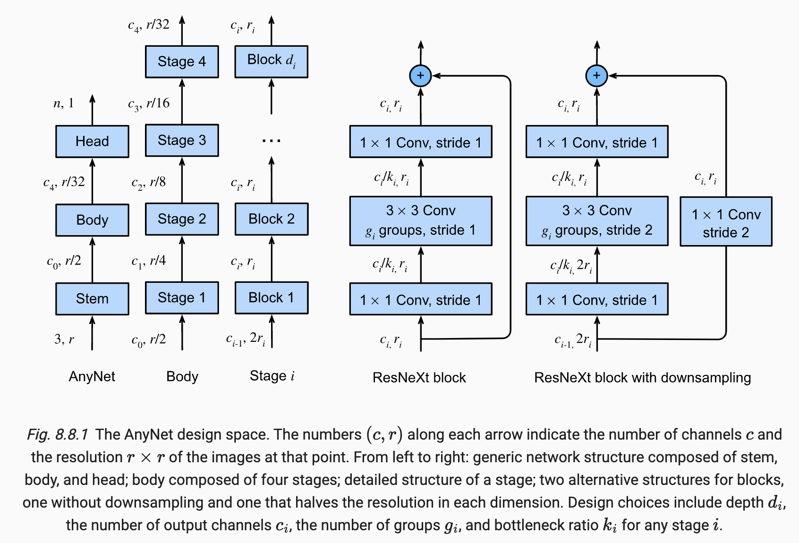

# Notes

## Convolutional Blocks
After LeNet (shallow prototype of the first cnn models), and AlexNet(designed by constructing convolutional layers, one conv + non-linearity + max-pooling), VGGNet showed that in order to be able to go deeper, several convolution kernels with non-linearities can be attached on top of each other before reducing the resolution with aggregation layers. It explored the idea of shallow and wide networks versus deep and narrower ones. For example, instead of 5by5 conv kernels that have $25\times c$ parameters, several 3by3 conv kernels with $9\times c$ parameters can be used.

## NiN: Network-in-Network; 1x1 Concvolution and Global Average Pooling
One issue with VGG is that the last fully connected layers take up too much space on RAM. Because they have a lot of parameters e.g. in the last example shown, ont FC layer required 100_000_000 parameters, and for single precision floats (FP32), it is 400MB of RAM. How to improve on this?

Issue is that we must have FC in the end, otherwise the spatial structure of image will be lost. To overcome this, in NiN they propose to do:

1. 1x1 convolutions: Basically allows FC of layers for each pixel (preserving spatial structure) with non-linearity in between. Couples in the channel dimension.
2. Global Average Pooling in the end. This is only possible because we had the 1x1 convolutions in earlier layers. takes much less space for the same purpose. It is basically a NiN block as in earlier layers, but with num-classes as channels, followed by an Global Average pooling that pools all the information across the spatial dimensions leaving only num_classesx1x1 maps which can be flattened afterwards to get a vector of num_classes. This eliminates the use of costly FC layers, leading to less memory requirement, however with possibly higher training time.

## Structure of Modern CNNs
Consists of these three parts in general:

1. Stem (data ingesting): First 2 or 3 conv layers that extract low-level features from source image
2. Body (data processing): main body consisting of many conv layers
3. Head (prediction): maps the features obtained so far to the required classification, segmentations, detection, or tracking problem at hand.

## GoogleNet: Multi-Branch Networks
Revolutenized the idea to use multiple branches to process input with different goals in mind: different spatial resolutions, channel manipulation. Then they are concatenated in the end in the channel dimension. Hyperparameters of each branch is chosen such that the out spatial dimensions are the same so that they can be concatenated.

## Batch Normalization
a mehotd that consistently improves convergence of training DNN and has inherent regularization benefits.

Similar to feature preprocessing where we change features to have e.g. 0 mean and unit variance, or other techniques. One idea here for batch normalization and also layer normalization is similar but within the layers and inside the DNN. Values from layer to layer or inside the layers, can have varying magnitudes, or happen during the iterations of training and this could possibly making training such networks difficult. Clever optimization algorithms by using second order methods can deal with it, but another way as used here is to prevent it from happening in advance by adaptive normalization.

Another advantage is that the deeper networks become, the more prone to overfitting can they become. Hence regularization becomes important.

Magically, Batch Normalization, offers all of the benefits for a deep network: normalization (preprocessing), numerical stability (for optimization), and regularization.

Batch normalization can be used for a single layer, or for all alltogether. The approach is to first normalize the input, based on the data in the minibatch of current training iteration (Hence the name **Batch** normalization). Then they are rescaled and shifted accordingly to recover the lost degrees of freedom.

The size of the minibatch is very important here to get reasonable statistics from.

$
BN(x) = \gamma \odot \frac{x - \mu_B}{\sigma_B} + \beta
$

where B denotes over minibatch, $\mu$ and $\sigma$ are batch statistics, and $\gamma$ and $\beta$ are learned parameters that have the same shape as $x$.

_Side note_: This approach also injects some noise (for example the sigma is added by a small number to avoid division by zero). Which is usually good for training DNN and lead to better generalization, less overfitting, and faster training. Very large batch size, reduce the effect of the injected noise, and very small batch sizes lead to uninformative signals for normalization, hence both should be avoided and a number around 100 seems to do good.

Similar to the behaviour of Dropout where it is only applied in training and excluded during inference. Here during training batch norm is computed for each batch, but for inference and after training, statistics over all the train dataset is used for them.

For FC layers, it is placed after affine transformation and before non-linearity: $h = \phi (BN(Wx + b))$

For Conv layers, each channel is treated as a single layer. i.e. we compute the mean and variance across all location in spatial dimensions and all the examples in the minibatch, for each channel seperately. This follows that for each channel of a conv layer, we also learn a sclae and offset.

### Layer Normalization
**Note** for Conv layers, since we compute statistics over all locations, batch norm for even a minibatch size of 1 is well-defined. This is what is called **Layer Normalization**.

$
LN(x) = \frac{x-\hat{\mu}}{\hat{\sigma}}
$

Another advantage of Layer Normalization is that since it can be used for batchsize 1, it is the same for training and inference, and is a deterministic layer, because it does not depend on the batchsize or being in training or inference.

### Benefits of Batch Normalization
* can choose higher learning rate compared to not using. Training is more stable
* faster convergence, fewer training iterations for higher accuracy
* regularization via noise injection
* more robust to bad data preprocessing

## Idea behind ResNet
Adding layers and going deeper makes the model more complex, leading to possibly better optimization and arriving at the optimal function f*. However, by just adding more layers, we cannot make sure that the previous class (shallower model), is included in the new class of models. Consequently, while the span of model classes might grow bigger, it is not sufficient to conclude that they get also closer to the f*. However, if the newly added layer can model the identity function, then we are sure that it is the case, and that with deeper models, we are getting a more complex (larger class of models) while the previoous classes of models are a subset of it. This is the idea behind Residual blocks. Each block by default has the identity mapping, and therefore if left as is, with the residual path being 0, we have the same model as before adding the deeper layers.

### Resifual Block structure
In the original ResNet, the main path has a 3x3 conv -> batch norm -> ReLU -> 3x3 Conv -> Batch norm. Then this is added with the residual/shortcut connection. Thia either directly forwards the input x or uses a 1x1 conv layer to adjust the number of channels to be the same as the main path. Because we are adding them together and they have to have the same shape. After addition, they are passed to in a ReLU.

## Grouped Convolution
The residual connection is the same as before. But the convolution layers in the main connection is grouped into several branches and concatenated afterward similar to a Inception block. However, here not much tuning is used and all the groups have the same structure: 1x1 conv -> 3x3 conv -> concat. Instead of computing convolutions of $c_i$ channels to $c_o$ channels, we have g convolutions from $c_i/g$ input channels to $c_o/g$ output channels. If we compare the two, in the first one without group convolutions, the complexity is $\mathcal{O}(c_i \cdot c_o)$ and for grouped convolutions we have $\mathcal{O}(g \cdot (c_i/g) \cdot (c_o/g))$. This is g times faster. Also it requires g times less memory for the parameters. The overhead are the 1x1 conv layers which are much cheaper.

## DenseNet
The idea is similar to ResNet, but instead of adding $f(x) = x + g(x)$, the DenseNet concatenates with the skipped-connection, and also connects it to all the previous layers. It has a form like: $x \rightarrow [x, f_1(x), f_2([x, f_1(x)]), f_3([x, f_1(x), f_2(x, f_1(x))]), ...]$

Main componenets are:
* _dense blocks_: defines how the inputs and outputs are concatenated.
* _transition blocks_: controls the number of channels so that it is not too large.

## Desigining Network guideline
Read more here if you want [Designing network design spaces](https://arxiv.org/abs/2003.13678). 

Stem: rgb image input -> 3x3 conv (stride 2 to halve resolution) -> Batch norm.

Head: Global average pooling -> FC

Body: Block is shown on the right most picture. it uses stride 2 to halve the resolution. 

Some guidelines: increase width and depth in deeper stages, i.e. $d_{i+1} \geq d_i$ and $c_{i+1} \geq c_i$.

Some numbers for a design of 32 layer RegXNet (From the paper, they make observations about overall design of DNN): **g=16** (group width), $c_1=32$, $c_2=80$, $d_1=4$ and $d_2=6$. channles follow this $c_j = c_0 + c \times j$ for some $c > 0$. 

These numbers should be taken with a grain of salt. Not definite and task plays a role which not considered here. But very general guidelines.

## Final note on modern CNN
Vision transformers based on transformer models and attention are superior to CNN for vision tasks. Using a pretrained transformer on large LAION-5B achieves better accuracy. same performance can be obtained by CNN but with a higher cost. This is true for **Large-scale image classification tasks**. I am not sure whether these transformers that surpass CNNs do need always need large data, or it is that just true in any case and one should use CNN for smaller ones or not. But the main point said in lecture is: **Scalability trumps inductive biases** which I think means that transformers are good for training at scale hence scalabality, and CNN are the inductive bias part because we a priori inject the bias of locality and translation equivariance into the CNN models which apparently is not the same in transformers.

# Not understood