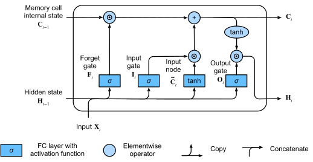
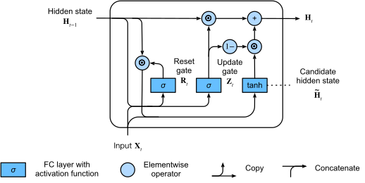

# Notes

## LSTM

uses input, forget, and output gates, to imlpement a memory cell, where roughly, the memory cell internal state is kept internal and not exposed to output or input.

## GRU

# Not understood

### BLEU Score
