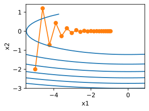
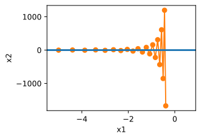
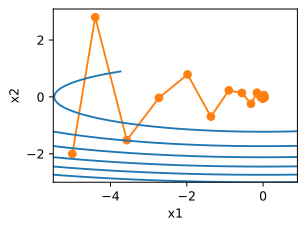

# Notes

## Convexity

Ways to show convexity of a function:

* f is convex iff: $\forall x, y \in X, \lambda \in [0,1]: f(\lambda x + (1-\lambda)y) \leq \lambda f(x) + (1-\lambda)f(y)$

* The hessian of f is positive semi-definite: f is convex iff $\nabla^2f \succeq 0$ or in other terms $x^THx \geq 0$ for all x. Hessian = second derivative.

## How to solve constrained convex optimization problems

* Lagrangian: Add all the $c_i(x) \leq 0$ constraints with a lagrange multiplier to the objective function. The saddle point solution of the problem is the optimal point for the original constrained problem.

* Projection: projecting the gradients or the destination point at each step onto the convex set.

### Stochastic Gradient Descent

In ML, to compute the gradient for all training examplpes is very expensive especially for large datasets. Therefore, **i.i.d samples** of the data is used to fix the computation cost for each gradient to a reasonable number.

## Dynamic Learning Rate
Several choices, usually updated in fixed intervals or when progress in optimization does not change or get's too low.

* piecewise constant: $\eta(t) = \eta_i$ if $t_i \leq t \leq t_{i+1}$

* exponential decay: $\eta(t) = \eta_0 e^{-\lambda t}$

* polynomial decay: $\eta(t) = \eta_0(\beta t +1)^{-\alpha}$ where usually $\alpha=0.5$

## Optimization with Momentum - Leaky Averages

Here a velocity $v$ of the past gradients are used with a parameter $\beta$ which for small values shorter history of gradients are contributed and with larger value, more history. This gradient is replaced by the current one and is calcualted as follows:

$
v_t = \sum_{\tau=0}^{t-1} \beta^\tau g_{t-\tau, t-\tau-1} =
g_{t,t-1} + \beta v_{t-1}
$
where g is the gradient for step $t-\tau$ given the parameters of the step before that.

Accelerated (Momentum) optimization is especially effective for ill-posed problems (Here ill-posed was meant as objective function being too skewed in one direction). Consider the example for $f(x_1, x_2)=0.1x_1^2+2x_2^2$. Before, we could manage overshoots or slow training by adjusting learning rate. But here, one gradient is small and the other is large, hence causing issues.

If we choose higher learning rate to make training faster, x2 overshoots as a result.

With momentum (if $\beta=0$ then we get default GD) the aggregation of gradients in x1 will give well-aligned gradients and hence increase the distance covered at each step. For x2, they will cancel out and smoothen the path taken.

Typically $\beta=0.9$.

## Adagrad
In some cases, such as in NLP, recommender systems, ..., we deal with sparse features. For example, in NLP, the word 'heterogenous' appears rarely in training data. Also note that we generally reduce learnning rate as training goes on (usually at a rate of $\mathcal{O}(t^{0.5})$ or smaller). However, in the case of sparse features, we would be either reducing lr too quickly for sparse features or too slow for frequent ones.

A hack to address this issue is instead of rescheduling lr by $\eta = \frac{\eta_0}{\sqrt{t+c}}$, we could use $\eta_i = \frac{\eta_0}{\sqrt{s(i,t) + c}}$ where s(i,t) counts the number of nonzeros for feature i that we have observed up to time t.

This is nice, but it is tricky to judge when a feature was seen, and with which magnitude, etc. Adagrad uses the same idea but differently. It adjust the lr for each dimension based on the gradient it has seen so far for that dimension. $s(i+1,t)=s(i,t)+ (\partial_if(x))^2$. Learning rate for coordinates that correspond to large gradients are scaled down more rapidly than the ones with lower gradients magnitudes.

## RMSprop
One issue with Adagrad is that the state variable adds square of gradients per coordinate without any normalization which can lead to unbounded values. Idea here is to use a leaky average to address this.

$
s_t = \lambda s_{t-1} + (1-\lambda)g_{t}^2 \\
x_t = x_{t-1} - \frac{\eta}{s_t + \epsilon} \odot g_t
$

with this normalizatin, we can schedule the learning rate $\eta$ independently of the scaling applied on a per-coordinate basis.

So, it is similar to Adagrad by preconditioning scales coordinate-wise. But uses leaky-average for that.

## Adadelta
Is another variation of Adagrad. Uses leaky-average of second momentum and also the change of variable to do the step updates. It is known to not having a learning rate.

$s_t = \rho s_{t-1} + (1- \rho)g_t^2$

This is like RMSprop. Difference is that update step uses the rescaled gradient.

$
x_t = x_{t-1} - g'_{t} \\
g'_t = \frac{\sqrt{\Delta x_{t-1} + \epsilon}}{\sqrt{s_t+\epsilon}}\odot g_t
$

where $\Delta x_{t-1}$ is the leaky average of the squared rescaled gradient.

$\Delta x_{t} = \rho \Delta x_{t-1} + (1-\rho)g'^2_t$

## Adam
Adam uses all the tricks before for a robust optimization algorithm.

$v_t = \beta_1v_{t-1}+(1-\beta_1)g_t$

$s_t = \beta_2s_{t-1}+(1-\beta_2)g^2_t$

commmon choices are $\beta_1 = 0.9$ and $\beta_2 = 0.999$, i.e. variance moves slower than the momentum term.

Normalized state variables is used for updates,

$\hat{v}_t = \frac{v_t}{1-\beta^t_1}, \hat{s}_t = \frac{s_t}{1-\beta^t_2}$

rescaled gradient is computed with,

$g'_t = \frac{\eta \hat{v}_t}{\sqrt{\hat{s}_t} + \epsilon}$ where typical value for $\epsilon$ is 1e-6.

The update step now is: $x_t = x_{t-1} - g'_t$

## Learning Rate Scheduling
Many ways to do; theory not well-understood why it benefits. But there are cases where:

* initial warm-up can be useful: idea is, parameter initialization might not be enough, so for the first few epochs, by starting from a small learning-rate, one would linearly increase lr to the value wanted initially, and then let the scheduler kick in. 

* the scheduling can be done polynomial, factor, or piece-wise among many other.