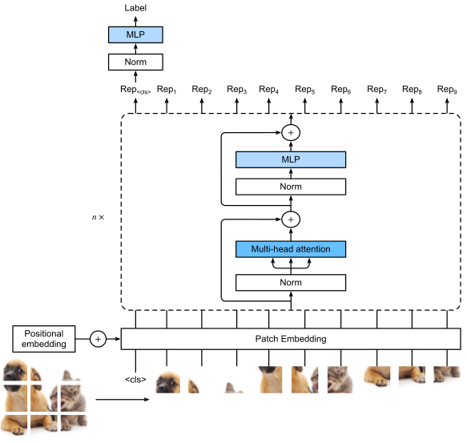

# Notes

At the core of transformers, is the **attention pooling** operation which is a linear combination of values depending on coefficients derived from query and keys.

Typically, $\alpha$ can be chosen as any similarity function, but are normalized later by passing through a softmax layer.

## Attention Scoring Functions
In order to compute similarity between query and key, kernels can be used and typically the only requirement is that they are non-negative and sum up to one. While kernes based on distances can be used for this reason, it turns out that computing scores (matrix-multiplication) is simpler and faster than distances. Hence kernels in transformers are scoring functions between query-keys followed by a softmax. Furthermore, we have $||q-k_i|| = q^Tk_i + ||k_i|| + ||q||$. With some minor adjustments, we can see that distance in our typical cases is equivalent to the dot-product. Note that q is equal for all attention and since we are normalizing it afterwards, it doesn't impact the distance. Moreover, $k_i$ is typically passed through a layer or batch norm, and these layers make sure that $||k_i||=constant$, hence also this term doesn't impact the score. This is just to say that dot-product and distance measure can be relevant and equal if each are normalized.


### Scaled dot product attention
With the points mentioned aboce, we already see why the dot-product is a useful measure for distance between query and key. The scale of it is because if we assume each vector q and k has dimension d and 0 mean and unit variance, after multiplying the two vectors, the result will have 0 mean but a variance of d. Hence we also normalize this score function. $a(q, k_i) = q^Tk_i/\sqrt{d}$. Note that these values are passed through a softmax to be normalized and non-negativated.

### Additive Attention
Another scoring function is additive attention. In the case where q and k have different dimensions, one can use an intermediate matrix for dot-product evaluation $q^TMk_i$ or use additive attention. The intuition is that two single layer MLP with hidden size h is used and added together in the h space. $a(q,k) = \mathbf{w}_v^T tanh(\mathbf{W}_qq + \mathbf{W}_kk) \in \mathbf{R}$ where the w parameters are learnable.

### Batch Matric Multiplication
For multiplying batches of matrices as is done for attention pooling, use ```torch.bmm()```.

## Multi-head attention
Using multiple subsets of attention pooling to allow for different attentions, e.g. short or long range, by applying different learned linear projections of queries, keys, and values applied to attention pooling in parallel. There is a W for each head for each of the q, k, v. The output is also a linear projection of the concatenated outputs of all the heads. The attention pooling is like before, scaled dot-product or additive. All W s are learnable. 

# Self-attention
In contrast to Bahadanau attention mechanism where decoder steps where queries to attend to encoder states, in self-attention, each token (in the encoder or decoder) is represented as a query and can attend to any of the other tokens and build a representation by attention pooling over the tokens, hence self-attention. Here, when computing the value of a token's representation at the next layer, the token can attend (via its query vector) to each other token (matching based on their key vectors). This way, we can compute for each token a attention representation. The attention scoring function for each input token $x_i$ is $y_i = f(x_i, (x_1, x_1), ..., (x_n, x_n))$ where the first parameter is the query and the rest are key-value pairs. The function for self-attention is attention|(X, X, X, valid_lens). 


Comparison criterias:
* Computational complexity
* Sequential operations (prevents parallel computation)
* Maximum path length (shorter allows for easier learning of long-range dependence)

For CNNs: kernel size k, n layers, d input and output channels; Comp. complexity is $\mathcal{O}(knd^2)$. CNN are hierarchical, so Sequential operations is $\mathcal{O}(1)$. Max path length is $\mathcal{O}(n/k)$, i.e. x1 and x5 are within the receptive fiels of a 2-layer CNN with k=3.

For RNNs: Computational complexity is $\mathcal{O}(nd^2)$. Sequential operations is $\mathcal{O}(n)$ which cannot be parallelized. Max path length is $\mathcal{O}(n)$.

In Self-attention: q,k,v are nxd matrices, e.g. in sclaed dot-product attention, two nxd and dxn matrices are multiplied resulting in a nxn matrix which is multiplied to a nxd matrix for values, hence computational complexity is $\mathcal{O}(n^2d)$. Sequential operations is $\mathcal{O}(1)$. Max path length is $\mathcal{O}(1)$.

The quadratic term in sequence length makes self-attention slow for large sequences.

## Positional Encoding
By default, transformers don't know explicitely about the position of the token when doing attention pooling operations (RNNs do because they know the relative position, one coming after the other, but in weighted sum, no such information). Therefore, either learnable or fixed positional encoding are added to the input. $X \in \mathbb{R}^{n\times d}$ is the input of n tokens in a d space. $X+P$ where P is the positional encoding. The values of P for i-th row and 2j or 2j+1-th column is defined as follows.

$
p_{i, 2j} = \sin(\frac{i}{10000^{2j/d}}) \\
p_{i, 2j+1} = \cos(\frac{i}{10000^{2j/d}})
$

How does this relate to encoding positions of tokens?

### Absolute positional information
Consider if we wanted to represent each token (every row in the positional encoding) with a number assigned to it using bits. The first bit (lowest value) has the highest frequency by transitioning from 0 to 1 to 2 and so on. While the last bit (highest bit) has the lowest frequency of switching between 0 and 1 for consecutive numbers. It is similar to here. consecutive columns change between sin and cos. earlier columns have higher frequencies compared to later columns. Using this continous version of encoding position is much more compact than the binary representation and easier to work with continous functions. Here each column could be considered as one of the bit positions where for each row i it is evaluated at every position.

### Relative positional information
By using a fixed positional encoding, any model can learn to attend to any relative position to i with offset $\delta$ by a simple linear projection. This is because for any fixed positional offset $\delta$, the positional encoding at position $i+\delta$ can be represented by a linear projection of that at position $i$ as follows.

Consider $\omega_j = \frac{1}{10000^{2j/d}}$. any pair $(p_{i, 2j}, p_{i,2j+1})$ can be linearly projected to $(p_{i+\delta, 2j}, p_{i+\delta,2j+1})$ for a fixed offset $\delta$:

$$
\begin{bmatrix}
\cos(\delta \omega_j) & \sin(\delta \omega_j) \\
-\sin(\delta \omega_j) & \cos(\delta \omega_j)
\end{bmatrix}
\begin{bmatrix}
p_{i, 2j} \\
p_{i, 2j+1}
\end{bmatrix}
= ... =
\begin{bmatrix}
p_{i+\delta, 2j} \\
p_{i+\delta, 2j+1}
\end{bmatrix}
$$

## Transformer


## Vision Transformer
ViT scale better for larger models and data, but for small even imagenet with 1.3 mil images, still ResNet and CNNs are betterm because they have prior beliefs integrated into the architecture.

consists of a stem that patchifies the image, a body using transformer, and a head that transforms the global representation into class labels.

a hxw image is first split into $m=hw/p^2$ patches of size pxp. then each patch is flattened into a vector of size $cp^2$ where c is the number of channels. In this way, image patches can be trated as sequences by transformer encoder. the m patches together with a special \<cls> token is transformed into m+1 token vectors. Each are added to a **learnable** positional embedding. The transformer is the same as before, only the Norm is replaced. The output of the transformer encoder for the \<cls> token is used to predict class label.

The patch embedding is done via a convolution layer where kernel and stride size is set to the patch size.

The MLP is slightly different than the PositionwiseFFN. Here for activation, GELU(Gaussian Error Linear Unit) is used which can be considered a smoother version of ReLU. Also dropout is applied to the output of each fully connected layer of the MLP for regularization. For GELU, dropout is applied after activation function.

The normalization in self-attention of transformer is placed before the heads of self-attention which leads to more effective and efficient training.

# Not understood

* I don't get why in positional encoding, sin and cos are interleaved for each columns. Can't only one be used? Maybe because of the relative positional information, but not sure.